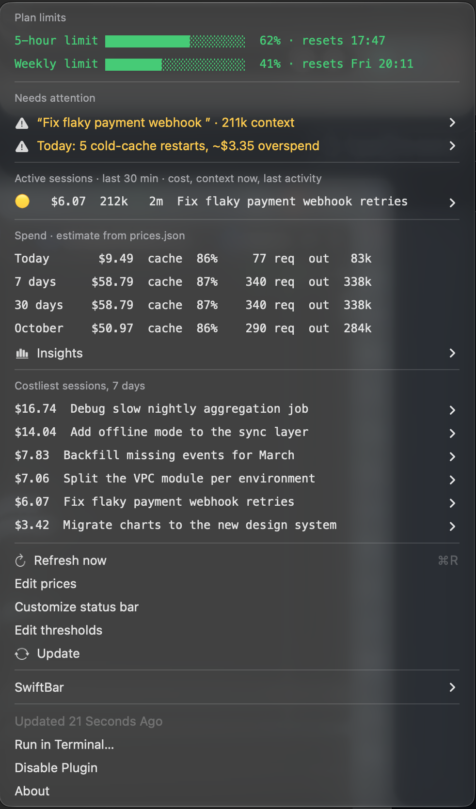
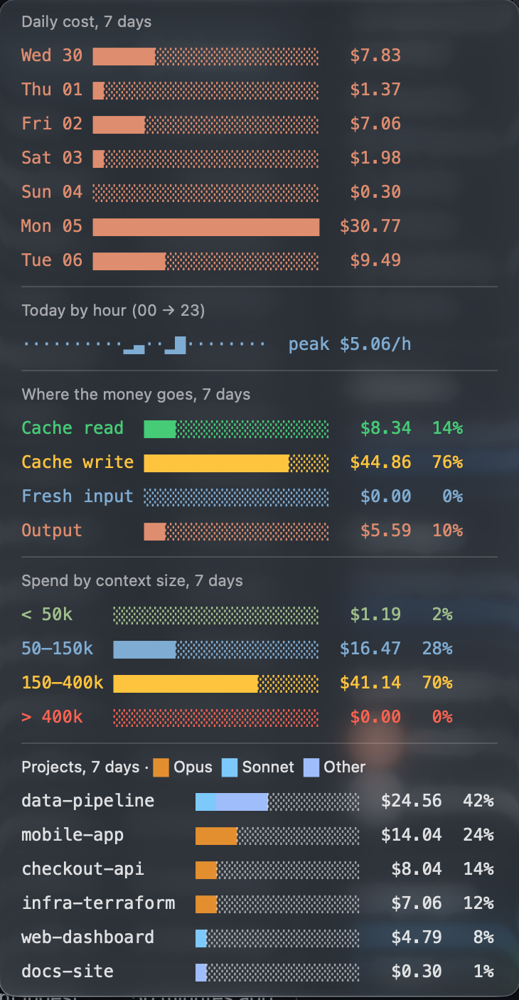

<h1 align="center">Claude Code telemetry widget</h1>

<p align="center">
  Your Claude Code spend, context and cache state, live in the macOS menu bar.<br>
  Read from local transcripts. Nothing leaves your machine.
</p>

<p align="center">
  <a href="https://github.com/patrickbykov/claude-telemetry-widget/releases/latest"></a>
  
  
  <a href="LICENSE"></a>
</p>

<p align="center">
  <a href="#quick-start">Quick start</a> ·
  <a href="#what-you-get">Features</a> ·
  <a href="#update">Update</a> ·
  <a href="#uninstall">Uninstall</a>
</p>

<p align="center">
  
  
</p>

## Quick start

> One line, about a minute. Safe to re-run.

```sh
curl -fsSL https://raw.githubusercontent.com/patrickbykov/claude-telemetry-widget/main/install.sh | sh
```

The Claude usage item appears in the menu bar. Plan limits show after the next Claude Code status update.

**Requires:** macOS, [SwiftBar](https://github.com/swiftbar/SwiftBar), Python 3.9+. The installer offers to install anything missing with Homebrew.

## What you get

| Feature | What it does |
|---|---|
| 📊 **Menu bar** | 5h/7d plan usage, active sessions, items needing attention (oversized context, cold cache) |
| 🧾 **Session report** | `session-report.py <session-id>` writes a self-contained HTML cost review |
| ⏳ **Cache watch** | A launchd job notifies you shortly before a session's prompt cache expires |
| 💾 **Compaction saver** | A `PostCompact` hook saves each compaction summary to `~/.claude/compactions/` |

## Install

From the one-liner above, or from a clone:

```sh
git clone https://github.com/patrickbykov/claude-telemetry-widget.git
cd claude-telemetry-widget
./install.sh
```

The installer is safe to re-run. It:

1. checks prerequisites and lists what is missing (Homebrew Python 3.12 only if the system Python is older than 3.9; a missing Claude Code CLI is only a warning);
2. creates a venv with Pillow;
3. links the plugin into your SwiftBar plugin folder (`~/swiftbar-plugins` if none is set);
4. starts the cache-watch launchd job;
5. adds the `statusLine` and `PostCompact` entries to `~/.claude/settings.json`;
6. adds SwiftBar to your login items and launches it.

<details>
<summary>Options and details</summary>

- `-y` accepts all prompts: `curl ... | sh -s -- -y`.
- `SWIFTBAR_PLUGINS=<dir>` overrides the plugin folder.
- `INSTALL_DIR=<dir>` overrides the clone location for the curl install (default `~/.claude-telemetry-widget`).
- Your original `settings.json` is kept once as `settings.json.bak`. An existing, different `statusLine` is left alone.
- Scripts re-run themselves under the venv via `use_venv.py`, so the system Python also works.

</details>

## Update

Click **Update** at the bottom of the menu. An orange **Update available** row appears when upstream has new commits (checked once a day). Or run:

```sh
~/.claude-telemetry-widget/update.sh   # or ./update.sh from your clone
```

It pulls with `--ff-only`, then re-runs the installer. If you edited `config.json` or `prices.json`, it stops and prints how to stash your edits first.

## Uninstall

```sh
./uninstall.sh           # stop the job, remove the plugin link and settings entries
./uninstall.sh --purge   # also delete usage.db, reports and the venv
```

SwiftBar and the folder stay; delete the folder yourself to remove the code.
